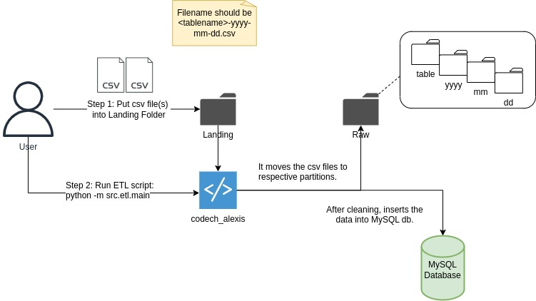
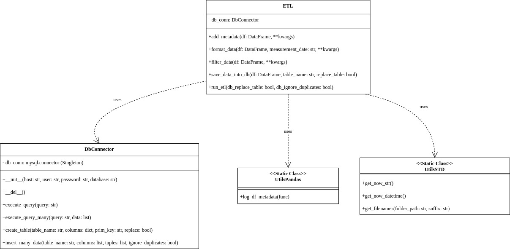

# Bitcoin Stocks ETL

This project implements an ETL (Extract, Transform, Load) system for bitcoin stocks.

## General Architecture


## Features

- The date and time are combined in a single column "trx_datetime".
- The application reads all csv files in data/landing path and process them in date order.
- Csv files should be in the following format: <table_name>-yyyy-mm-dd.csv.
- Once a file is read it is moved to the raw folder in the partition table_name/yyyy/mm/dd/.
- The previous step avoids processing twice the same file since it is already moved.
- Database connection is managed but the database should already exist.
- Database and host configuration should be set at .env file.
- Audit data is added to the table in database.
- Duplicate rows are removed and insertion also ignore duplicated values.


## Project Structure

```
.
├── src/
│   ├── etl/
│   │   ├── main.py         # Core ETL implementation
│   └── utils/
│       ├── db_connector.py # MySQL Database connection handler
│       ├── utils_pandas.py # Pandas utility functions
│       └── utils_std.py    # Standard utility functions
├── test/                   # Test directory
├── data/                   # Data directory
│   ├── landing/            # ** Directory where to put the csv files **
├── requirements.txt        # Project dependencies
└── requirements-test.txt   # Test dependencies
```

## Class Architecture


### ETL Class (main.py)
- Handles the complete ETL workflow.
- Supports data formatting and filtering.
- Manages audit columns addition.
- Moves data files from landing to raw folder.
- Saves the processed data into de configured database.

### Database Connector (db_connector.py)
- Manages database connections
- Supports query execution
- Table creation and management
- Bulk data insertion with duplicate handling

### Utilities
- Pandas utilities for DataFrame operations
- Standard utilities for timestamp management and file operations

## Setup and Usage

1. Set up a virtual environment:
   ```bash
   python -m venv .venv
   source .venv/bin/activate  # On Unix/macOS
   .venv\Scripts\activate     # On Windows
   ```

2. Install dependencies:
   ```bash
   pip install -r requirements.txt
   ```

3. Copy the .env_template to .env file and write your database configuration.

4. Put all data for ingestion into the data/landing/ directory.

5. Run the ETL process:
   ```bash
   python -m src.etl.main
   ```

## Requirements

**You must previously have created a database so you can write the credentials and database in .env file.**

All other requirements are specified in `requirements.txt` and `requirements-test.txt` for testing dependencies.
They should be installed in step 2 of Setup and Usage.

